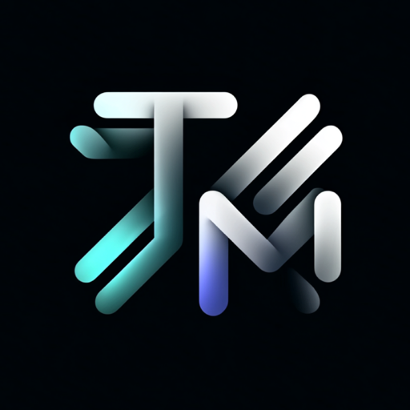

<div align="center">
  
  <h1>Gauntlet Terminal</h1>
  <p><strong>Your coding agent, with a cockpit.</strong></p>
</div>

An alt-terminal for [Claude Code](https://claude.com/claude-code). One window
hosts **many Claude sessions** as top tabs — each runs the real `claude` CLI in
its own PTY and carries its own **cockpit**: a sidebar of live telemetry for
*that* session. Context-window %, token burn, your plan's **5-hour + weekly
usage** (a live `/usage` mirror), what the agent is doing _right now_, its todo
list, and the latest code-review/TDD verdict — every number describes one
session, never an aggregate.

Around the terminal sits a set of repo-aware **tabs** — sessions, tickets, pull
requests, human-in-the-loop items, notes, and a file editor — so the work
surface lives next to the agent instead of in a browser. The terminal stays
mounted when you switch tabs, so a session never drops.

> Built for a Gauntlet AI hackathon, then kept going. macOS-first. Dark theme,
> [lucide](https://lucide.dev) icons, IBM Plex type.

---

## Quick start

Requires [bun](https://bun.sh) and the `claude` CLI on your `PATH`.

```bash
git clone https://github.com/trevormil/gauntlet-terminal.git
cd gauntlet-terminal
git submodule update --init   # vendors project-template (for scaffolding)
bun install                   # also rebuilds node-pty against Electron's ABI
bun run dev                   # launch the dev build
```

On **first launch** a short onboarding probes your machine (which of
`claude`/`codex`/`gh`/`glab` are installed + authenticated) and confirms your
projects folder — everything has a working default, so you can skip it. After
that, `bun run dev` opens the **session picker**: resume an existing Claude
session, start a new one in any folder, or **spin up a brand-new project from a
template** (see below). New sessions launch `claude --session-id <uuid>`;
resumed ones launch `claude --resume <id>` in the session's original directory.

The app is **self-configuring** — only `claude` is required; `codex`, `gh`, and
`glab` are optional and enable the features that use them. See
[**Setup & settings**](#setup) for the full picture.

### Install it as a real app

Package a branded, double-clickable macOS app:

```bash
bun run dist        # → dist/Gauntlet Terminal-<ver>-arm64.dmg  +  dist/mac-arm64/Gauntlet Terminal.app
```

It's an unsigned local build, so after packaging give it a clean ad-hoc
signature, then drag it to `/Applications` and pin it to the Dock:

```bash
codesign --force --deep --sign - "dist/mac-arm64/Gauntlet Terminal.app"
cp -R "dist/mac-arm64/Gauntlet Terminal.app" /Applications/
open "/Applications/Gauntlet Terminal.app"   # right-click → Open the first time
```

See [`docs/runbooks/build-and-release.md`](docs/runbooks/build-and-release.md).

## Tabs

A title-bar switcher puts full-screen surfaces alongside the terminal. Tabs are
repo-aware — each shows based on the attached session's repo.

- **Terminal** — the `claude` CLI plus the cockpit sidebar.
- **Sessions** — the repo's working-state session docs
  (`sessions/NNNN-slug/session.md`, the [project-template](#project-template)
  convention): status, goal, linked tickets/branches/PRs, rendered body.
- **Tickets** — browse/filter/create tickets from the repo's `backlog/`,
  **grouped by status** (closed/icebox collapsed by default). Inline
  status/priority edits write back to the markdown file.
- **PRs / MRs** — live pull/merge requests via `gh` (GitHub) or `glab` (GitLab),
  **auto-detected per repo** from the remote (the tab + vocabulary switch between
  "PR #N" and "MR !N"). Each opens a full review surface: description, the
  **review** body, **findings** + **suggestions**, a syntax-highlighted **diff**
  (unified/split, per-file "viewed"), forge **CI status**, and a **merge** button.
- **HITL** — tickets flagged `hitl: true`: the things waiting on a human
  (approvals, creds, merges). The tab carries a live count.
- **Agents** — on-demand [Codex](https://github.com/openai/codex) agents you
  **Run** from a button. See [Agents](#agents) below.
- **Notes** — markdown editor (edit/split/preview). Repo notes live at
  `<repo>/.gauntlet-terminal/notes.md` (auto-gitignored); Global notes span
  everything. Both autosave.
- **Files** — a lightweight editor: CodeMirror (real syntax highlighting,
  find/replace), multi-file tabs, a file tree with type icons + git-ignored
  dimming, and project-wide search (`git grep`). ⌘S save · ⌘W close · ⌘F find ·
  ⌘⇧F project search.
- **Activity** — a realtime feed + macOS notifications: a session finishing a
  turn, a ticket filed, a session start. Global store, filterable to this
  repo/session.

## Cockpit widgets

The sidebar is a stack of widgets, each describing the attached session. Toggle
them in the **Plugins** drawer (top-right on the Terminal tab). Defaults:
**Session** (title/model/mode/branch/turns), **Context Window**, **Now Doing**
(latest tool call, live), **Plan Usage**, **Todos**, **TDD / Review**, **Git**.
Off by default but available: **Model**, **Tool Use**, **Token Burn Rate**,
**Open PRs**.

Two kinds of widget — both auto-discovered, no marketplace:

- **Code plugins** — a folder under `src/renderer/src/plugins/<id>/index.tsx`.
- **Command widgets** — declarative "run this command every N seconds", in JSON,
  including **per-repo** widgets loaded from the attached repo.

## <a name="agents"></a>Agents

On-demand agents you trigger from a **Run** button on the Agents tab. Each run
gets its **own git worktree** off the default branch; the engine does the work,
files tickets for findings, and opens a **PR/MR** for any code changes — all
streamed live into the tab (with cancel + worktree controls). A launch picker
chooses the **engine** ([Codex](https://github.com/openai/codex) or
[Claude](https://claude.com/claude-code) — only the ones installed are offered),
an optional **persona** (security, performance, frontend, …), and a **pipeline**
(single run, or chained review/iterate stages).

Eight ship **by default on every repo** — Improve docs, Deep audit, Ticket/PR
cleanup, Strengthen tests, Security sweep, Performance pass, Dependency hygiene,
and Dead-code cleanup.

Override or add your own per-repo in `.agents/agents.json` (merged by id over the
defaults):

```json
[{ "id": "perf", "title": "Perf pass", "icon": "Zap",
   "prompt": "/document  …or any codex prompt; commit + open a PR", "opensPr": true }]
```

## <a name="project-template"></a>Spin up new projects (project-template)

Gauntlet Terminal pairs with
[project-template](https://github.com/trevormil/project-template) — a
self-contained workflow scaffold (sessions → tickets → branches → PRs → review →
human merge, with in-repo `.reviews/`, cadence `.checks/`, TDD gate, and the
ticket/session schemas these tabs read). It's vendored here as a git submodule
at `templates/project-template` and kept in sync with the upstream repo.

**From the session picker** — the "New project from template" card: name it,
pick a parent folder, hit Create. It copies the template into a **brand-new**
directory (never overwrites an existing one), runs `git init` + a first commit,
and opens a session there.

**From the terminal:**

```bash
bin/new-project my-app                  # → ~/CompSci/gauntlet/my-app
bin/new-project my-app /path/to/parent  # custom parent
```

Both refresh the template to the latest upstream before copying. To bump the
pinned submodule:

```bash
git submodule update --remote templates/project-template
```

## <a name="setup"></a>Setup & settings

Most config lives in the in-app **Settings** panel (gear icon, top-right) and is
saved to `~/.config/gauntlet-terminal/settings.json`:

- **Projects & worktrees** — where the picker looks for repos; where agent
  worktrees go; the scaffold template repo.
- **Engines** — detected `codex`/`claude` with install/auth state; per-engine
  path overrides; default engine.
- **Code forge** — `auto` (gh for GitHub remotes, glab otherwise) / force
  GitHub / force GitLab, with live install + auth readiness per CLI.
- **Telegram** — native Bot API notifications + AFK remote control (paste a
  BotFather token + chat id, hit **Test**). Falls back to legacy
  `~/.claude/bin/telegram-*.sh` scripts if no token is set.
- **Setup & integrations** — install the [`gt-notify`](docs/setup.md#5-activity-feed-hook-gt-notify)
  activity hook, and **copy a setup prompt for Claude** to install the global
  agent skills on a fresh machine.

Full walkthrough (GitHub vs GitLab, global skills, Telegram, the activity-feed
contract): [**`docs/setup.md`**](docs/setup.md).

### Environment overrides

| var                | default  | what it does                                                    |
| ------------------ | -------- | --------------------------------------------------------------- |
| `GT_CLAUDE_BIN`    | `claude` | the Claude binary to launch (Settings → Engines also sets this) |
| `GT_CONTEXT_LIMIT` | auto     | context-window cap. Auto = 200k (bumps to 1M past 200k tokens). |

```bash
GT_CONTEXT_LIMIT=1000000 bun run dev   # if you run 1M-context sessions
```

## Writing a plugin

A plugin is a folder under `src/renderer/src/plugins/<id>/index.tsx` that
default-exports one object. Drop it in — it auto-registers (Vite glob), appears
in the Plugins drawer, and mounts when toggled on.

```tsx
import { Brain } from 'lucide-react'
import { Card, Big, Gauge } from '../../components/ui'
import type { Plugin, TranscriptStats } from '../../lib/types'

const plugin: Plugin<TranscriptStats> = {
  id: 'context',
  title: 'Context Window',
  icon: Brain, // a lucide-react icon component
  blurb: "Live % of the model's context window in use.",
  intervalMs: 2000,
  defaultEnabled: true,
  realtime: true, // also refresh the instant the transcript changes
  poll: (gt) => gt.transcript(), // read live state via the typed bridge
  render: (d) =>
    d?.ok ? (
      <Card icon={Brain} title="Context Window">
        <Big value={`${d.contextPct.toFixed(1)}%`} />
        <Gauge pct={d.contextPct} />
      </Card>
    ) : null,
}
export default plugin
```

`poll` runs on `intervalMs` (and on every transcript tick if `realtime`);
`render` draws the card. The `gt` bridge exposes the data sources
(`gt.transcript()`, `gt.usage()`, `gt.harnessTdd()`, `gt.gitStatus()`,
`gt.sessionTasks()`, …). New data source = extend `src/main/` + the preload
bridge.

## Writing a tab

Same model — a folder under `src/renderer/src/tabs/<id>/index.tsx`
default-exporting `{ id, title, icon, order, appliesTo(ctx), Component }`.
`appliesTo(ctx)` gates visibility on the attached repo; an optional
`badge(gt)` paints a live count on the tab (that's how HITL shows its number).

## Command widgets (no code)

Declare a widget that runs a shell command on an interval and renders its
output — global (`~/.config/gauntlet-terminal/widgets.json`) or per-repo
(`<repo>/.gauntlet-terminal/widgets.json`, loaded when you attach there).

```json
[
  {
    "id": "uncommitted",
    "title": "Uncommitted",
    "command": "git status --porcelain | wc -l | tr -d ' '",
    "intervalMs": 4000,
    "mode": "big"
  }
]
```

`mode` is `text` (raw stdout), `big` (first line as a number), or `kv`
(`key: value` lines as rows). Commands run in the attached session's directory.

> **Trust:** command widgets run arbitrary shell, and per-repo widgets come from
> the repo you attach to — only attach to repos you trust (same model as running
> their npm scripts).

## How it works

- **Electron** shell. `node-pty` (main) runs `claude`; **xterm.js** (renderer)
  draws it — the same pattern VS Code's integrated terminal uses. Each session
  tab is its own PTY, keyed in main; data IPC reads the active session.
- The UI is **React + Tailwind v4**, built with **electron-vite**. Widgets and
  tabs poll a typed `gt` bridge exposed via `contextBridge`.
- **Context / burn / now-doing / todos** come from the attached session's
  transcript (`~/.claude/projects/<cwd-hash>/<session-id>.jsonl`) and task files,
  read by session id.
- **Plan usage** mirrors `/usage` via `GET /api/oauth/usage` using the OAuth
  token Claude Code stores in the macOS keychain. Cached ~2 min (rate-limited).
- **PRs / TDD / review** read code-review artifacts from the repo's in-repo
  `.reviews/<pr>/` (project-template) or the legacy autopilot-harness `prs/`
  store, computing `current` vs `stale`.

See [`docs/architecture.md`](docs/architecture.md) for the full map.

## Repo layout

```
src/main/            Electron main: PTY spawn, IPC, fs readers (transcript, backlog, mrs, files, scaffold)
src/preload/         the `gt` bridge (contextBridge)
src/renderer/src/
  App.tsx            multi-session shell (session tab bar)
  SessionView.tsx    one session: terminal + cockpit + tabs
  components/        Terminal (xterm), CodeEditor, MrDetail, TicketsBrowser, ui kit
  plugins/<id>/      one folder = one cockpit widget (auto-discovered)
  tabs/<id>/         one folder = one full-screen tab (auto-discovered)
  lib/               types, badges, file-type icons, formatters
templates/           project-template (git submodule) — scaffolding source
bin/new-project      scaffold a new repo from the template
build/               app icon (.icns/.png) for packaging
```

## Contributing

It's just code — fork it, drop a plugin or tab folder in, send a PR. `bun run
build` type-checks the bundle; `bunx tsc --noEmit` is the full type gate.

## License

[MIT](LICENSE) © Trevor Miller
